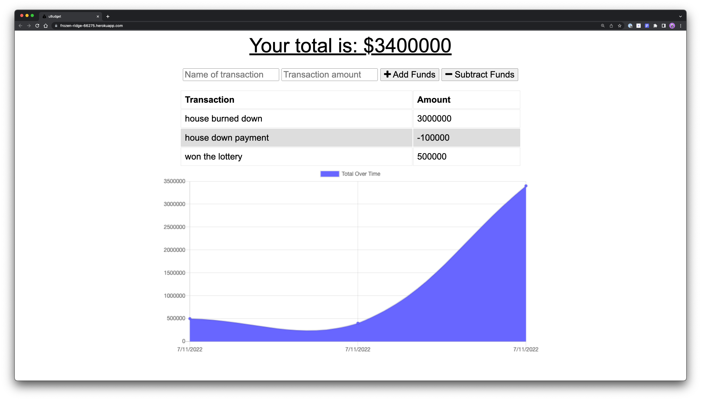

# uBudget

## Purpose
A progressive web application that allows users to track their expenses and deposits without having to be connected to the internet.

## Heroku Link.
https://frozen-ridge-66275.herokuapp.com/

## Screenshot


## Built With
* HTML
* CSS
* Node.js
* Express
* MongoDB
* mongoose

## User Story

```
AS AN avid traveler
I WANT to be able to track my withdrawals and deposits with or without a data/internet connection
SO THAT my account balance is accurate when I am traveling
```

## Acceptance Criteria

```
GIVEN a budget tracker without an internet connection
WHEN the user inputs an expense or deposit
THEN they will receive a notification that they have added an expense or deposit
WHEN the user reestablishes an internet connection
THEN the deposits or expenses added while they were offline are added to their transaction history and their totals are updated
```

## Contribution
Made with ❤️ by Joshua Ramat